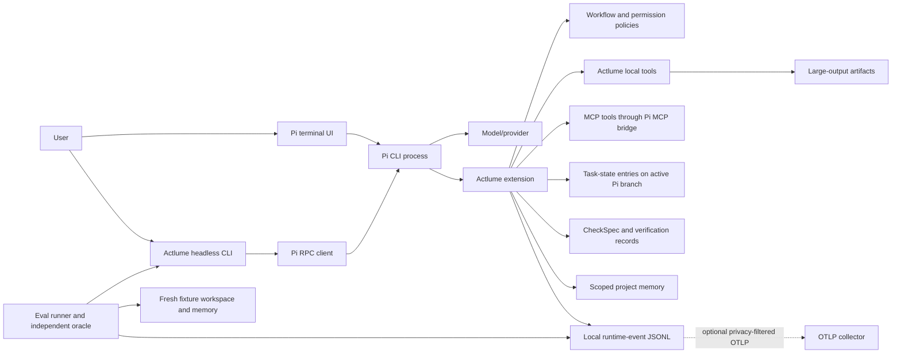

# Actlume runtime architecture

Actlume runs on the public Pi CLI/RPC runtime. Pi owns the assistant loop, transcript, terminal UI, model transport and MCP process lifecycle. The Actlume extension owns project-specific policy, task state, local tools, memory, verification evidence and structured runtime events.

## State ownership

The Pi transcript is the conversation record. Versioned Actlume task-domain entries in the active Pi branch are the source for the task projection; the workspace event journal, verification files, memory index and context artifacts are projections or supporting stores with their own schema checks. A Pi branch switch changes conversation ancestry and task-state projection. It does not roll back files on disk, so verification is rechecked against current workspace fingerprints.

## Responsibility boundary

| Pi runtime | Actlume |
| --- | --- |
| Model loop, transcript, terminal UI and native compaction | Task/run identity and branch-aware task projection |
| Provider request transport and MCP lifecycle | Workflow policy and explicit tool permission decisions |
| RPC and public extension hooks | Typed memory scope, provenance, invalidation and promotion |
| Built-in terminal rendering and session files | CheckSpec evidence, completion-claim classification and JSON results |
| | Eval fixtures, runner, independent oracle and comparison validation |

Actlume does not claim to own Pi's model reasoning or transcript compaction. Its optional OTLP exporter maps a privacy-filtered subset of Actlume events; local JSONL remains the source of truth. Trace delivery diagnostics are process-local, and delivery is not exactly-once.

## Security and evaluation limits

The extension allowlist limits tools exposed to a scoped child, and MCP is disabled for that child. This is a tool-surface boundary inside the Pi process, not an operating-system sandbox or an independent filesystem access-control boundary. A child with read tools can read beyond the task's suggested paths unless the operating environment supplies stronger isolation. The Eval runner uses unique workspaces, isolated memory and an empty MCP config, but deterministic-provider passes only validate protocol behavior; they do not establish model quality or strategy benefit.
