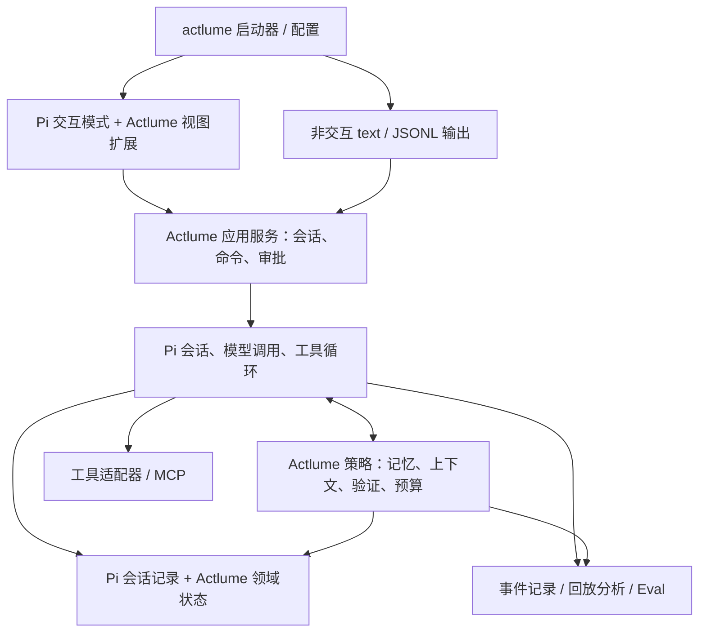

# Actlume 改造计划：Pi 底层、终端交互、记忆与执行可靠性

日期：2026-10-04
源码基线：256e476
目标岗位：Agent / AI 应用工程
文档性质：基于当前源码的实施计划；文中的目标能力和目标指标不代表已经实现。

第二轮实施入口：[ACTLUME-ROUND-2-WORK-PLAN.md](D:/workspace/actlume-agent/docs/ACTLUME-ROUND-2-WORK-PLAN.md)。该文档依据 [2026-10-05 验收评估](D:/workspace/actlume-agent/docs/ACTLUME-REFACTOR-ASSESSMENT-2026-10-05.md) 定义剩余工作、任务 ID 和完成门槛；本文件保留原架构目标与第一轮实施记录。

**建议保留 Actlume，采用 Pi 的会话与执行能力，优先交付可日常使用的终端主屏，再集中完成“记忆随项目变化维护”和“完成声明有验证依据”两项工程工作。评测从迁移第一步开始建设。**

本计划将“类似 Claude Code 的终端主屏”理解为交互式 TUI：持续会话、多行编辑、流式回复、工具卡片、审批与状态栏。第一版不需要 Electron 或 Web 服务。

## 1. 阅读范围与验证结果

已检查 CLI 入口、Agent 主循环、模型适配、工具注册与调度、工作流状态与 Guardrails、Session、Memory、上下文处理、权限、MCP、Skills、Sub-Agent、测试、benchmark、日志回放、打包入口和 CI；同时查看同级 claude-code-from-scratch 的 README 与记忆章节。

改造前源码审计验证（历史基线，2026-10-04）：

- npm run typecheck：通过。
- npm test：95 项测试通过。
- 未调用真实模型，未重新运行开源仓库修复任务。
- 未运行 npm run benchmark：源码显示它会先删除当前工作目录中的 .agent-benchmark；本次保留已有运行现场。静态检查显示其主要是 16 个工具、配置和行为用例，不能作为 Issue Resolve Rate。
- M0 后续已安装并锁定 `@earendil-works/pi-coding-agent@1.0.2`；本机 Node `v24.14.1` 符合该版本 `>=22.19.0` 的要求。已通过 Pi CLI 的离线模型列表实测 TypeScript 扩展加载、兼容 Provider 注册与模型选择；没有调用真实模型。

实施进度更新（2026-10-05）：Pi TUI/RPC 主路径、Actlume 工具适配、run-local Guardrails、验证证据、记忆/上下文预算、只读并行研究、OTLP/HTTP Trace 和 Eval 汇总器均已有实现及本地测试。最新 `npm run ci` 通过 128 项测试与 16 项确定性 smoke；npm pack 成功，但生产依赖安装被 registry 证书主机名错误阻断。不要将 mock provider 当作真实模型评测。10 个开发用例已冻结为场景卡，但夹具和隐藏验收器尚未物化；真实模型任务 Eval、终端人工验收、托管 Trace 接收端与远程 Windows CI 结果仍未证实。不能声称 M0–M5 的全部验收已经完成。

测试通过说明被测试的行为成立，不等于所有 README 功能已经接通。下面将源码事实与待验证风险分开。

## 2. 当前项目的关键问题

| 项目 | 源码事实 | 改造影响 |
| --- | --- | --- |
| 主循环 | [agent.ts:197](D:/workspace/actlume-agent/src/agent.ts:197) 手动循环，解析模型输出的 action/final JSON；LLM、策略、打印和完成判断混在一起 | 用 Pi 取代基础协议，抽出策略与界面 |
| 会话恢复 | [main.ts:582](D:/workspace/actlume-agent/src/main.ts:582) 传入 initialHistory / initialWorkflowState，但 [agent.ts:163](D:/workspace/actlume-agent/src/agent.ts:163) 重置工作流，随后新建空 history | 恢复参数未进入执行链路；交互式连续任务也受影响 |
| 流式输出 | CLI 传入 streaming，但 [agent.ts:209](D:/workspace/actlume-agent/src/agent.ts:209) 调用 callLLM 时没有传递 | UI 改造前必须打通真实增量事件 |
| 指令与记忆注入 | buildWorkspacePromptContext 和 buildMemoryPromptSection 在 agent.ts 中只有导入，未调用；当前 buildProjectContext 主要提供项目扫描信息 | ACTLUME.md / rules / typed memory index 的自动注入没有在主循环中接通；工具和 slash 命令的相关能力另行存在 |
| 大结果落盘 | persistLargeObservation 在主循环中只有导入；常规 tool_result 直接放入 history | 通用结果处理链路没有接通该能力；部分工具自身的截断或指针机制需保留检查 |
| 并行调用 | runToolBatch 有单测，但没有被主循环调用 | “并行能力”目前主要是独立模块，迁移时应验证真实调度 |
| 状态隔离 | [edit-workflow.ts:50](D:/workspace/actlume-agent/src/edit-workflow.ts:50) 固定写 edit-workflow.json；[tools/agent.ts:53](D:/workspace/actlume-agent/src/tools/agent.ts:53) 子 Agent 复用 memoryDir 并启动同一主循环 | 存在父子任务覆盖工作流状态的路径；增加并发前必须修正 |
| 状态落盘时机 | [main.ts:602](D:/workspace/actlume-agent/src/main.ts:602) 在任务返回后保存快照 | 中途退出没有等价的执行检查点；不能宣称崩溃恢复已完成 |
| 完成状态 | [main.ts:601](D:/workspace/actlume-agent/src/main.ts:601) 将除 failed 之外的结果映射为 completed，包含 max_steps | 会话列表和评测可能把预算耗尽记成完成 |
| 当前终端 | [main.ts:294](D:/workspace/actlume-agent/src/main.ts:294) 使用 readline；运行时大量 console.log；输入循环 await 整次任务 | 缺少持续可控的交互主屏，无法及时处理运行中补充和取消 |
| 压缩与预算 | [context-policy.ts:8](D:/workspace/actlume-agent/src/context-policy.ts:8) 以最近窗口和输出长度裁剪；summary.ts 主要保留首尾；context-budget.ts 用字符数 / 4 估算 | 不是严格的预算分配器，也没有任务约束和证据的保留协议 |
| /compact | [main.ts:923](D:/workspace/actlume-agent/src/main.ts:923) 刷新项目扫描缓存 | 命令名称与对话压缩的通常预期不同，需要拆分语义 |
| 验证证据 | ChangedFileRecord / CheckRecord 主要记录路径、时间、命令和成功与否 | 验证没有绑定代码内容版本，恢复、并行和外部编辑后容易失效 |
| Guardrails | [workflow-guard.ts](D:/workspace/actlume-agent/src/workflow-guard.ts) 已有大量实际失败处理，但包含紧预算和 Python / Issue 专用规则 | 需要区分通用规则和任务策略，测量误拦截，避免整体照搬到 Pi |
| MCP 超时 | [mcp-client.ts:226](D:/workspace/actlume-agent/src/mcp-client.ts:226) 使用 Promise.race | 本地等待结束不代表服务端动作停止，写操作不能统一按 retryable 处理 |
| 测试与评估 | Session 测试覆盖文件保存与读取；流式测试覆盖字符串拼接；CLI 集成测试主要跑 --help | 需要补少量关键纵向测试，验证 CLI → Runtime → Tool → Session 的完整行为 |
| 回放可信度 | [replay-run.ts:139](D:/workspace/actlume-agent/scripts/replay-run.ts:139) 在缺少 tool_result 时假设成功 | 应改为 unknown；离线轨迹回放不能替代策略改变后的真实重新运行 |
| 发布安装 | [bin/actlume.mjs:8](D:/workspace/actlume-agent/bin/actlume.mjs:8) 依赖包内 tsx，但 tsx 位于 devDependencies | 需要在干净环境验证生产安装；建议编译 dist 后发布 |

现有评估笔记记录了 Briefcase、Scrapy、sentry-python、js-utils 四个项目。它们很适合做失败案例来源，但目前文档不能支持“20+ 仓库、统一条件下测得收益”的表述。

优先处理这些问题的理由：新 TUI、多 Agent 和记忆功能都依赖一致的会话状态。先明确状态和事件的含义，后续界面与评测才不会各自解释一套结果。

## 3. 目标定位与范围

建议定位：

> 基于 Pi 的本地 Coding Agent，提供交互式终端工作台，通过带来源和适用范围的任务记忆、可追溯的验证证据及可复现评测，提高跨会话开发任务的连续性与可靠性。

形成三项可交付成果：

1. 可使用的产品：安装后可进入终端主屏，持续对话、查看工具、审批、取消、恢复。
2. 可解释的机制：记忆更新与失效、验证证据与完成状态、按失败类型实施的工作流策略。
3. 可复现的证据：固定模型与任务条件的对照、原始轨迹、失败归因和成本报告。

第一版限制范围：

- 单用户、本地工作区；Windows Terminal + PowerShell 优先，同时保留 Linux CI。
- 支持现有 OpenAI-compatible 模型配置；新增供应商优先通过 Pi，避免继续维护自有适配矩阵。
- 长期记忆先覆盖“项目约束、经过验证的命令和处理经验”，暂不扩展为通用个人知识库。
- 子 Agent 首先维持只读研究用途；并行写入与 Worktree 延后。
- 不以记忆层数、工具数量和 Agent 数量作为目标。

## 4. 架构与职责划分

当前路线：Pi coding-agent CLI 的公开 npm 可执行入口 + Actlume 扩展同时承接交互 TUI 与非交互 RPC。TTY 任务以位置消息打开 Pi TUI；无 TTY 时使用公开 `RpcClient`，由同一 Pi CLI 子进程管理会话、工具和 MCP。Actlume 的 Pi Tool adapter 注册既有本地工具；旧 ReAct 只由 `--legacy` 显式启用。

Pi 1.0.2 公开导出 InteractiveMode、SessionManager、createAgentSession、`RpcClient` 和 `main(args, options)`。InteractiveMode 构造器要求完整 AgentSessionRuntime，单独创建 AgentSession 不足以启动 TUI；`main()` 没有 cwd 参数。当前使用 Pi CLI 子进程并从 manifest 的 `bin.pi` 定位入口，以 `cwd` 隔离工作区；`RpcClient` 支持非交互请求、事件和持久会话。Pi session 放在 Actlume memoryDir 下，旧 transcript 不自动导入。[SDK](https://github.com/earendil-works/pi/blob/main/packages/coding-agent/docs/sdk.md) · [公开导出](https://github.com/earendil-works/pi/blob/main/packages/coding-agent/src/index.ts) · [CLI/RPC](https://github.com/earendil-works/pi/blob/main/packages/coding-agent/docs/cli-integration.md) · [TUI](https://github.com/earendil-works/pi/blob/main/packages/coding-agent/docs/tui.md)



| 领域 | 负责方 | 边界 |
| --- | --- | --- |
| 模型协议、流式、工具循环、会话 transcript | Pi | 不再维护 action/final 文本协议 |
| 终端输入、基础 transcript、组件生命周期 | Pi TUI | 整个交互进程只有一个终端渲染器 |
| 项目配置、模式与命令、应用状态 | Actlume | 统一供 TUI 和非交互运行使用 |
| 记忆的来源、作用域、适用条件和失效 | Actlume | Pi 压缩不等同于这些应用语义 |
| 验证证据、任务完成标准、策略干预 | Actlume | 不把模型结束输出直接等同于任务成功 |
| 会话记录的持久化 | Pi SessionManager | 不维护第二份可独立修改的消息历史 |
| 任务状态、验证和记忆数据 | Actlume 扩展记录 / 外部存储 | 会话内状态跟随活动分支；跨会话记忆单独保存 |
| 指标与 Trace 导出 | Actlume 适配层 | 优先复用 Pi 已有 usage / 事件，不重复计算 |

实施原则：

- 先接入 coding-agent SDK；暂不降到 agent-core 重建一遍 Session、Skills 和 TUI。
- 先通过适配器接入现有工具，记录错误语义、参数校验和权限行为；再合并重复工具。
- MCP 只保留一个进程与连接管理者。先验证 Pi MCP 与现有配置的兼容性，再切换；禁止两套管理器同时拉起同一个 server。
- SDK 与 CLI 的默认加载行为有差别。当前 SDK 文档要求显式接入 MCP 等内置扩展；这属于接入验收项。
- 工具前置权限校验必须覆盖普通调用、嵌套调用、MCP 和终端执行入口。工具清单不等于 OS 沙箱。
- Pi 默认压缩作为基线；自定义上下文策略只有获得可测收益才启用。
- Pi 上游已有实验性 pi-durable。第一版不依赖它的未稳定 API，也不将“接入持久化库”包装为原创崩溃恢复。
- 若锁定版本无法稳定嵌入完整 TUI，使用 Pi CLI + Actlume 扩展作为过渡；先验证公开入口，避免依赖内部源码路径。

## 5. 优先级与阶段安排

估算按一名开发者、每天约 6 小时有效开发计算；属于规划区间，不是交付保证。M0 后根据 API 兼容性调整。

| 阶段 | 优先级 | 工作 | 前置依赖 | 估算 |
| --- | --- | --- | --- | --- |
| M0 | P0 | 固定基线、行为缺口清单、Pi 接入验证、关键集成夹具 | 无 | 2 天 |
| M1 | P1 | Pi Runtime 接入、会话语义、工具/配置适配、基础事件 | M0 | 4–6 天 |
| M2 | P1 | 可日常使用的终端主屏、审批、取消、恢复与非交互模式 | M1；视图可用假事件提前开发 | 2–4 天 |
| M3 | P1 | 验证证据、完成判定、Guardrails 分层和中断处理 | M1，使用 M2 展示 | 3–4 天 |
| M4 | P1 | 有来源和失效机制的任务记忆、上下文预算 | M1、M3 | 4–6 天 |
| M5 | P1 | 对照与消融、失败报告、干净安装、演示和简历材料 | M1–M4；采集从 M0 开始 | 3–4 天 |
| M6 | P2 | 有范围的子任务协议、只读并行，必要时增加 Worktree 写任务 | M3、M5 显示有需求 | 5–8 天 |
| M7 | P2 | OpenTelemetry / Langfuse 导出与跨 Agent Trace | M1 事件稳定，M6 若纳入则一起覆盖 | 2–3 天 |

核心版本 M0–M5：18–26 有效人日。TUI 基础版在 M2 交付，不等到所有研究功能做完。

本地结构化事件和 usage 统计属于 P1；远程观测平台接入属于 P2。避免为接一个平台阻塞核心功能。

## 当前实施进度与边界（2026-10-05）

| 阶段 | 状态 | 已交付 | 尚缺的验收证据 |
| --- | --- | --- | --- |
| M0 | 本地入口验证完成；生产安装受 registry TLS 阻断 | Pi 1.0.2、Node 要求、模型解析、扩展 smoke、CLI/RPC 夹具、本地 mock-provider 轮次；npm pack 成功 | `npm install --omit=dev` 请求 `@hono/node-server@2.0.6` 时收到 `ERR_TLS_CERT_ALTNAME_INVALID`，所以安装后 `--help` 未验证；真实 API smoke 未执行 |
| M1 | 主链路与旧会话导入已实现 | TUI 与 RPC 都使用 Pi；约 31 个本地工具接 Pi schema；MCP 由 Pi 管理；session/run/toolCall 事件；Pi session 可继续；旧 JSON 会话只读浏览及显式历史文本导入 | 工具中断后的外部副作用恢复仍不保证 exactly-once；MCP 两项配置无精确映射 |
| M2 | 基础可用 | 原生 Pi TUI 提供多轮输入、工具展示、交互审批、流式、取消、会话选择；Actlume 增加 memory/context/doctor/changes/verify/result 命令 | Windows Terminal/PowerShell 与 Linux 的 IME、尺寸、粘贴、审批焦点等人工矩阵及演示录像未完成 |
| M3 | Pi 主路径 Guardrails 与证据流程已接通 | Git 工作区基线、改动文件 hash、检查退出码与指纹、过期检查失效；run-local plan/tool history；探索预算与重复失败决策事件；无当前通过验证的改动会请求补验或明确说明未验证 | 仍无独立需求 oracle；补验是单次续跑提示，不替代人类/测试验收；MCP 远端副作用不覆盖 |
| M4 | 记忆生命周期、上下文预算及压缩记录已实现 | Markdown schema v2；candidate/active/needs_review、sourceRefs/scope/evidenceType/applicability；关联文件变化后自动待复核；项目指令和记忆有上限预算；Pi 压缩成功/失败事件；artifact 可分块回读 | 召回仍是关键词/CJK 字符串算法；无语义召回、冲突合并或托管记忆；字符/4 是预算估计而非 tokenizer 精算 |
| M5 | Harness、开发任务卡和本地 CI 已验证 | `npm run ci` 通过类型检查、128 项测试与 16 项隔离功能 smoke；本地 mock-provider 纵向测试覆盖 Pi RPC、Actlume 工具、工具结果回流和事件；JSONL Eval 汇总独立 verdict、成对结果、恢复、过期记忆误用和未知 usage；`evals/tasks/dev-v1.md` 冻结 10 张协议开发场景卡；Windows CI 已配置 | 场景卡的夹具/隐藏 oracle 尚未物化；无真实模型重复运行、正式对照/消融、托管运行 trace 或真实收益报告；npm 生产安装被 TLS 主机名错误阻断；远程 Windows runner 与人工 TUI 验收未完成 |
| M6 | 只读 Scoped Research 原型已实现 | 最多三个并行独立 Pi 子 session；只读 allowlist、MCP 禁用、深度/步数/超时限制、父取消传播、结构化发现与 parentRunId 关联；双子任务 RPC 集成测试通过 | 没有 M5 任务数据证明并行提高效果/效率；无并行写入 Worktree；未知 token usage 保持缺失 |
| M7 | 本地 OTLP/HTTP spans 原型已实现 | Agent/run/tool/model usage/策略等事件映射、跨子 Agent trace parent 关系、属性白名单；本地 HTTP collector 夹具验证格式和隐私边界；导出失败不阻塞任务；doctor 显示配置状态 | 未用真实 Langfuse/托管 collector 验收；实现是轻量 OTLP JSON exporter，不是 OpenTelemetry SDK 自动埋点，也未验证生产 collector 兼容性 |

Eval 汇总命令：`npm run eval:summary -- <records.jsonl> [baseline=candidate]`；输入格式与限制写在 [evals/README.md](D:/workspace/actlume-agent/evals/README.md)，十个尚未执行的开发用例在 [evals/tasks/dev-v1.md](D:/workspace/actlume-agent/evals/tasks/dev-v1.md)。汇总器与场景卡都不包含结果；真实模型、固定夹具及隐藏验收器仍待运行前构建。

## 6. M0：固定基线与验证 Pi 可行性

架构决策记录见 [ADR 0001](adr/0001-pi-cli-runtime.md)。

具体工作：

1. 记录源码版本、模型配置字段、当前工具集合、配置优先级和各权限模式的期望行为。
2. 将“模块存在但链路未接通”的能力列成行为契约，不在旧主循环上继续投入大规模功能开发。
3. 创建可控模型响应 / mock provider 与临时工作区，补充关键纵向用例：连续两轮、恢复、流式、工具失败、预算耗尽、父子状态。
4. 锁定 Pi 发布版本和 lockfile；核对 Node 最低版本、Windows 终端、PowerShell、provider 配置、MCP 与 TUI API。
5. 做一个隔离的接入实验：同一会话完成读文件、写文件审批、运行测试、取消、再次提问、恢复。
6. 确定支持公开 InteractiveMode 还是 CLI + extension 过渡，记录一页架构决策。

验收：

- 95 项现有测试仍可运行，区分策略回归测试和旧 JSON 协议测试。
- 新夹具能稳定暴露已识别的断链问题；迁移后作为回归检查。
- 至少一个现有模型配置通过 Pi Provider 注册与无网络模型解析；真实模型 API smoke 另行执行并明确标记。
- Pi 版本、公开 API、MCP 管理者、TUI 启动方式均有确定选择。

不要把旧 Runtime 与新 Runtime 的任务表现直接用于证明记忆收益。旧 Runtime 的已知断链会使对比失真；它主要用于迁移回归。

## 7. M1：Runtime、会话与状态

具体工作：

1. 将 main.ts 拆为参数/配置、命令服务、运行服务和界面入口。策略和工具不再直接 console.log。
2. 引入薄的 Pi 适配边界，提供创建/继续会话、提交输入、补充任务、取消和订阅事件。接口只满足当前需要，不做通用多框架平台。
3. 将现有 ToolDefinition 转换为 Pi 工具定义；保留结构化错误码、内容引用和副作用类型；正确映射失败，避免把 ok:false 当正常结果。
4. 建立统一工具前后处理：权限 → 参数校验 → 执行 → 结果归一化 → 证据记录 → 大结果处理。
5. 同一交互会话包含多次 run；sessionId、runId、toolCallId 分开，子任务另有 agentId。
6. 同一会话的可变状态使用明确的串行写入所有者；工具并行时避免读改写覆盖。不要依赖最后写入胜出。
7. 建立任务状态：idle、running、waiting_approval、cancelling、cancelled、interrupted、failed、budget_exhausted、completed。终止原因与任务验收结果分别记录。
8. 断开旧 JSON 协议在新执行链路中的依赖。迁移开关仅用于短期回归，达成验收后归档旧实现。
9. 原有 Session 数据提供只读查看与显式导入。旧数据缺少信息时标记不完整，不伪造工具结果和历史事实。
10. ACTLUME.md、规则、Skills 和记忆入口通过受控资源加载接入；明确优先级、去重和适用范围。项目提供的外部文本不自动获得修改宿主权限策略的能力。

存储建议：

- Pi SessionManager 负责唯一的 transcript 真相源。
- 当前任务约束、计划状态和验证引用作为带 schemaVersion 的扩展记录，按活动会话分支恢复。
- 跨任务 Memory 保留 Markdown 主体及结构化元数据，索引可以重建。
- 工具原始输出保存为 artifact；会话和事件引用 artifact ID，不复制多份大文本。
- state 作用域至少包含 workspace / session / agent，消除全局 edit-workflow.json。
- 不同时维护两份可独立修改的状态日志。若有 sidecar 投影，保存来源 entryId，并允许重建。

验收：

- 第二轮能够引用第一轮的已验证结果；重启后的恢复结果与退出前一致。
- 切换工作区与分支不会带入另一任务的执行状态。
- max_steps / 取消 / 工具失败均不会显示 completed。
- 实际接收到流式 delta；大输出有可读取的原始引用。
- 无交互运行遇到需审批动作时返回明确的等待或拒绝状态，不无限等待输入。
- 父子状态隔离和只读双子任务集成用例通过；父任务取消传播已实现，但专门的中断注入验收仍需补充。

## 8. M2：终端主屏详细方案

### 8.1 主屏内容

下面是布局草图，示例任务与数值只说明设计，不是当前运行结果。

```text
 Actlume · repository / branch             model · 默认权限
────────────────────────────────────────────────────────────
 你：修复配置校验，并补充回归测试

 Agent：先检查配置入口和现有测试。
 ✓ 读取 config.ts                         可展开
 ✓ 修改 config.ts                         +12 / -3 · 查看 diff
 ● 运行目标测试                           4s · 查看输出

 任务：定位 ✓  修改 ✓  验证进行中
 记忆：采用 1 条项目约束；1 条记录需要复核
────────────────────────────────────────────────────────────
 › 多行输入；可补充当前任务或排队下一条
────────────────────────────────────────────────────────────
 运行中 · 上下文 18k / 128k · Token 统计 · 快捷键提示
```

第一版使用单列 transcript + 输入区 + 精简状态区。80 列终端隐藏次要字段；宽屏再显示扩展信息。默认不做常驻三栏仪表盘。

### 8.2 必须交付的交互

| 能力 | 行为与验收 |
| --- | --- |
| 欢迎页 | 展示工作区、模型、权限、继续上次会话入口；配置缺失时提供明确动作 |
| 多行输入 | 中文 IME、粘贴代码、历史、命令补全；不要求用行尾反斜杠才能输入多行 |
| 流式回复 | 文本增量渲染；工具输出折叠，长日志按需展开；不打印自定义 JSON thought |
| 工具卡片 | 显示等待/执行/完成/失败/取消、耗时、摘要；展开查看参数、输出与 diff |
| 审批 | 显示实际命令、cwd 或变更预览；支持本次允许/拒绝，范围授权后续再做 |
| 运行中输入 | 明确区分补充当前任务与排队新任务；使用 Pi 的 steering / follow-up 语义 |
| 取消 | 请求后显示 cancelling；确认宿主停止后才显示 cancelled；尚不确定的远端动作显示 unknown |
| 会话选择 | 展示标题、仓库、模型、更新时间和真实结束状态；恢复失败给出原因 |
| 验证卡片 | 展示命令、退出码、检查范围、对应代码版本；代码变化后显示“验证已过期” |
| 记忆面板 | 查看采用了哪些记忆、来源、范围、状态；支持修改、停用、重新确认 |
| 上下文面板 | 展示组成与估算，解释压缩/召回事件；明确估算值与 provider usage 的区别 |
| 结束结果 | 分别呈现修改、验证、未完成项，不以一段自然语言回答替代任务状态 |
| 非交互模式 | 无 TTY 时使用纯文本或 JSONL；stdout 数据流不混入 ANSI 和调试日志 |

建议命令：

- /new、/sessions、/resume：会话操作。
- /plan、/permission、/model、/mcp、/skills：迁移已有功能，尽量沿用 Pi 支持的交互。
- /memory：记忆列表和来源；/context：上下文组成。
- /verify：最近验证及其适用版本；/changes：本次任务的变更。
- /compact：真正压缩当前会话；原项目缓存刷新改为 /refresh-project。
- /doctor：模型、shell、MCP、数据目录和版本检查。

### 8.3 实现要求

- 使用 Pi 的 editor、tool renderer、widget、header/footer、overlay；不在扩展中再启动一个 readline 或第二个渲染器。
- AppState 由运行事件推导；渲染组件不调用模型、不改工作流状态。
- 审批输入有唯一所有者；生成中的文本不能抢走审批焦点。
- 默认沿用 Pi 快捷键，确有需要再增加；帮助提示与实际绑定一致。
- 取消信号传递到模型、可取消工具和本地进程树；Windows 必须验证子进程回收。
- 流式更新合并渲染，避免每个 token 重排完整历史；长历史使用上游滚动能力。
- 使用终端可见列宽处理中文、emoji 和 ANSI，不能用字符串 length 计算布局。
- 模型没有上报 usage 时显示未知或估算；价格数据缺失不显示伪精确金额。
- MCP / shell stderr 进入工具详情，不直接破坏主屏。

验收矩阵：Windows Terminal + PowerShell、Linux 终端；80×24 与 120×40；中文输入、emoji、多行粘贴、窗口缩放、长工具输出、审批焦点、取消和退出恢复终端。自动测试覆盖状态和关键按键路径，IME 与渲染体验保留人工验收录像。

TUI 的简历价值来自“运行中可干预、状态一致、证据可查看”，视觉皮肤本身不作为主要技术亮点。

## 9. M3：执行证据与 Guardrails

### 9.1 将完成判定绑定到具体证据

增加 VerificationRecord：

- 命令、cwd、开始/结束、退出码、工具状态。
- 检查类型和范围：语法、单元、集成、lint、build；不能互相替代。
- 检查覆盖的代码版本、工作区基线和测试环境指纹。
- stdout/stderr artifact 引用、关联 runId / toolCallId。

任务开始记录已有修改；判断“本次产生的变更”时避免把用户之前的脏工作区算作 Agent 成果。修改、分支切换和必要的环境变化使相关验证失效。成功测试只是它覆盖范围内的证据，不能自动证明整个 Issue 已解决。

完成判定独立于模型回答：任务要求、实际变更、当前版本的验证和未解决问题共同决定状态。允许任务被判为“无需修改”，但需要相应检查依据，避免强迫 Agent 为满足规则制造改动。

### 9.2 把现有规则分成三类

| 类型 | 示例 | 默认行为 |
| --- | --- | --- |
| 必须遵守的执行规则 | 权限边界、只读限制、缺少必要验证、跨任务状态写入 | 强制执行，记录明确原因 |
| 效率策略 | 重复搜索、探索预算、重复失败 | 先提示或要求改变策略，必要时停止；允许配置和消融 |
| 任务专用策略 | Python 同名测试函数、pytest 目标、Issue 定位规则 | 按项目/任务加载，不硬编码为所有任务的通用要求 |

每次策略决策记录 policyId、触发证据、allow/warn/block、恢复建议和版本。统计允许后的失败、拦截后的恢复、误拦截与额外成本。

尤其要重新评估“探索若干步后必须编辑”和“失败测试必须改代码才可重跑”。环境故障、偶发测试、需求澄清并不总需要源码修改。

### 9.3 明确恢复与重试边界

- 已持久化的会话记录恢复到最近确定状态。
- 读取类工具可按策略重试；文件编辑先检查内容与预期是否一致。
- shell / MCP 写操作超时或进程中断，状态可能是 unknown，优先核验结果。
- 不承诺任意 shell/MCP 工具 exactly-once；外部动作只有存在幂等标识或查询接口时才能自动协调恢复。
- 普通 Session 恢复与进程在工具执行中崩溃是两类验收场景，分别报告。

验收：构造旧测试结果、用户已有修改、工具超时、修改后崩溃、预算耗尽、无须修改、失败依赖安装等场景；结果状态与界面、持久化、评测报告一致。

## 10. M4：记忆与上下文工程

核心假设：带来源和适用条件的项目经验，在跨任务使用时能减少重复探索；项目发生变化后，失效检测可以减少过期信息误用。该假设需要对照实验，不预设一定有收益。

### 10.1 第一版只处理三种信息

| 信息 | 保存范围 | 维护方式 |
| --- | --- | --- |
| 用户确认的工程约束与项目决策 | 项目或用户明确指定的范围 | 变更时新记录替代旧记录，保留出处 |
| 经验证的命令、环境处理经验 | 仓库、相关配置/依赖版本 | 依据变化后标记待复核 |
| 当前任务目标、进度和未决事项 | 当前会话分支 | 恢复和压缩时保留，不默认提升为长期记忆 |

第一版不自动把所有模型总结写为长期事实。推测和失败原因可以作为候选记录，但必须标注证据性质。

### 10.2 记忆数据与生命周期

建议字段：id、schemaVersion、kind、content、scope、sourceRefs、evidenceType、createdAt、updatedAt、applicability、status、supersedes、lastUsedAt。

- scope 区分 repository / worktree / task / user；不能把“路径相似”当同一项目。
- applicability 存相关文件指纹、依赖信息或需重验条件；不能因任意无关文件改变就废弃全部记忆。
- status 区分 candidate、active、needs_review、superseded、disabled。
- 遇到新旧事实冲突，保留来源并提示复核；不能仅凭更新日期自动判断真假。
- 用户修改、停用应同步影响检索索引；明确原始会话日志仍可能保留历史内容。
- Markdown 继续作为可读数据，结构化元数据采用版本化 schema；索引先保持可重建，规模或检索指标证明必要后再引入 FTS / 向量检索。

### 10.3 召回与压缩流程

1. 根据任务和作用域生成候选。
2. 过滤停用、已替代和明确失效的记忆。
3. 结合当前目标选择少量内容；对含混候选再使用可选语义重排。
4. 按 Token 预算注入，并附来源引用。
5. 记录 selected / rejected / invalidated 的原因，供 /memory 和 /context 展示。
6. 任务结束时根据验证结果提出新增或更新候选。

上下文按项目指令、当前任务状态、检索记忆、近期消息和工具证据分配预算；优先保留当前约束与未决问题。较旧工具输出保存引用并支持重新读取；不能仅把路径塞进摘要却没有可访问工具。

恢复时先重建活动分支状态，再读取适用记忆。上下文压缩不重新执行工具，也不把被放弃的分支决策带回当前任务。

验收场景：

- 同一仓库的后续任务复用已验证测试命令。
- 修改测试配置后，旧命令被标记待复核。
- 用户改变要求后，旧决策不再主导回答。
- 分支 A 的实验结论不影响分支 B 的稳定任务。
- 长工具输出压缩后仍可找回必要证据。
- 不相关记忆不会因为词面相似被大量注入。

## 11. M5：评测、发布与简历证据

### 11.1 三种验证分开报告

| 层次 | 用途 | 不应声称 |
| --- | --- | --- |
| 确定性测试与故障夹具 | 验证状态、权限、数据格式、取消和恢复契约 | 不能说明模型任务成功率 |
| 端到端模型任务 | 判断真实执行是否改善 | 单次成功不能说明稳定收益 |
| 真实日常使用记录 | 发现产品交互和未预料失败 | 未控制条件的前后体验不能直接作消融结论 |

从已有四个仓库的失败类型提取任务。先准备 8–12 个开发用例跑通协议，再准备独立保留任务；正式报告可扩展到约 20–30 个任务，每个配置至少多次运行，最终规模由方差、成本和结论强度决定。

任务类别：短任务回归、长上下文、多次压缩、跨会话经验复用、配置变更、需求修订、中断恢复。开发场景卡另含一项只读并行研究案例；它尚未作为有效性评测运行。

### 11.2 对照设计

- 固定模型版本、provider、采样参数、预算、工具权限、仓库 commit、环境和任务描述。
- 对照使用原生 Pi 的默认上下文/会话能力，而不是故意移除其基本能力。
- 在相同宿主与工具下，对 Guardrails、记忆策略分别启停，形成可归因对照。
- 比較自定义压缩时，单独改变压缩策略；避免同时更换模型、工具和提示词。
- 多次运行并交错执行配置，报告分母、失败原因与不确定性。
- 跨会话记忆任务使用固定学习阶段 + 未见过的后续任务；不得导入评测答案或测试集修复补丁。
- 不以同一条旧轨迹离线重放结果推断模型在新策略下会成功；被干预后的后续行为需要重新运行。

### 11.3 主要指标

- 任务正确率：由独立测试或验收条件判断，不由 Agent 自己宣布。
- 错误完成声明：声明完成但独立验收不通过的次数与比例。
- 恢复成功率：在规定中断点恢复并达到验收条件的次数与比例。
- 过期记忆误用：在前提变化后仍按旧记忆行动的次数与比例。
- 成本：provider usage、辅助召回/压缩调用、耗时、工具执行次数。
- 策略代价：误拦截、补救步骤、用户介入次数。

Step 和 Tool Call 只作解释性指标。记录“模型请求、请求的工具调用、实际执行、策略拦截、自动重试”各自数量，避免一个计数混合多种行为。缺失 usage 标为未知，不补成零。

故障注入必须包括真实子进程终止的测试；仅在函数内 throw 或重新创建对象不能代表 OS 进程崩溃。外部副作用的测试使用受控服务。

### 11.4 事件、Trace 与日志

从 M1 起统一记录 sessionId / runId / agentId / parentRunId / toolCallId、事件顺序、时间、状态、usage 和 artifact 引用。

业务事件至少有：任务开始/结束、工具开始/结束、审批、策略决策、记忆选择/失效、上下文压缩、验证完成/失效、取消与恢复。

完整 prompt 与工具原文按需保存在本地；常规观测只保留必要字段与引用，对凭据等内容做脱敏。M7 再将这些事件映射为 Agent → LLM → Tool / MCP spans。异步子任务用关联关系连接，导出失败不能阻塞 Agent。

### 11.5 发布验收

- 改为构建 dist 并发布，或者明确提供生产必需的运行时依赖；推荐前者。
- 固定关键依赖，提供可复现安装和升级说明。
- CI 增加 Windows；在临时目录安装 npm pack 产物并使用生产依赖验证 --help、非交互和入口启动。
- 基础测试不需要真实密钥；真实模型 smoke 和成本实验独立触发。
- /doctor 检查的是实际可用能力，不能因为目录字符串存在就报告成功。
- 录制一段持续对话、审批、验证、取消恢复和记忆失效的短演示。
- 提供一份公开可复现报告、典型失败轨迹和架构决策记录。

## 12. M6：Scoped Sub-Agent 的可选扩展

仅在评测发现任务可以独立研究或并行处理时投入。第一阶段保留只读子任务。

输入协议：目标、范围、输入来源、允许工具、预算、超时、期望产物、基础版本。

返回协议：状态、结构化发现、证据引用、未解决问题、实际 usage；不能只有“已完成”的自然语言。

执行要求：

- 独立 session 和领域状态；父任务取消能传播；限制深度、并发和总预算。
- 共享记忆只读；新记忆候选交给父任务核验后合并。
- 主任务按输入约束与证据验收结果，失败或过期结果不直接进入长期记忆。
- 并行读操作也要评估额外成本，比较最终耗时和成功率。

写任务进入第二阶段：

- 每个子任务明确基础 commit 与独立 Worktree。
- 收集补丁与验证记录；主任务负责集成和针对合并结果重新验证。
- 冲突进入明确处理状态，不自动用某一方覆盖另一方。
- Worktree 是文件工作目录隔离；执行权限与 OS 隔离另行处理。
- 仅清理本任务创建且可确认归属的临时工作区；保留未集成成果。

验收分别覆盖独立任务和强依赖任务。若强依赖任务并行后更差，应保留串行策略，而不是以子 Agent 数量证明能力。

## 13. 模块改造清单

以下路径是建议结构，不代表已经创建；保持单仓库单 package，暂不拆 monorepo。

```text
src/
  cli/             参数、配置兼容、doctor、启动
  app/             会话服务、命令路由、任务状态、审批
  runtime/pi/      Pi 接入、工具适配、事件归一化、资源加载
  policies/        Guardrails、预算、完成判定
  verification/    变更基线、检查记录、失效判断
  memory/          schema、存储、召回、更新、适用范围
  context/         预算、注入、压缩、artifact 引用
  ui/              Pi 扩展、工具渲染、任务/记忆/验证视图
  telemetry/       本地事件、usage、可选 Trace 导出
  tools/           保留必要的领域工具
evals/
  fixtures/        确定性场景
  tasks/           固定版本任务清单与独立验收
  runners/         配置对照、故障注入、隔离执行
  reports/         可复现结果与失败归因
```

| 现有文件 | 处理方式 |
| --- | --- |
| main.ts、cli-experience.ts | 拆分命令与界面；用 Pi 编辑器和渲染能力替换 readline 主屏 |
| agent.ts | 暂作旧基线；新链路使用 Pi，迁移完毕后归档或移除 |
| llm.ts、model-adapter.ts、output-parser.ts | 新链路替换；只保留仍需要的配置迁移与错误提示 |
| workflow-guard.ts | 提取规则 ID、策略输入、决策结果；区分通用与任务专用 |
| edit-workflow.ts | 改为按会话/任务的领域状态，并增加版本化验证证据 |
| session.ts | 旧会话导入/查看；新 transcript 交给 Pi |
| memory.ts、tools/memory.ts | 迁移旧记录，增加来源、范围、状态与失效 |
| context-policy.ts、context-budget.ts、context-artifacts.ts | 通过 Pi 上下文/压缩扩展接入，完成真实端到端预算与回读 |
| tools/registry.ts、tool-scheduler.ts | 工具适配与统一权限入口；完成行为等价后精简重复工具 |
| tool-batcher.ts | 对照 Pi 实际并发语义，保留必要限制，不形成两套调度器 |
| mcp-client.ts | 迁移配置与行为测试；管理连接的实现最终只保留一个 |
| security.ts | 保留权限语义，统一接入所有执行路径；准确说明能力边界 |
| prompt.ts、skills.ts | 通过资源加载适配，检查原有目录、命令和指令兼容性 |
| run-log.ts、replay-run.ts | 版本化事件；缺失结果为 unknown；区分观察回放和重新执行 |
| benchmark.ts | 更名为功能 smoke 或明确定位；在独立临时目录运行，避免覆盖使用现场 |

## 14. 建议实施顺序与每次交付

1. **基线与契约**：添加关键纵向夹具、记录已知缺口、锁定 Pi 版本。
2. **Pi 最小链路**：一次真实任务、工具适配、非交互输出、统一事件。
3. **会话与状态**：多轮、恢复、取消、终止原因和作用域隔离。
4. **TUI 基础主屏**：输入、流式、工具卡片、审批与状态栏。
5. **TUI 任务视图**：会话选择、变更/验证面板、运行中补充。
6. **执行可靠性**：版本化验证、完成判定、Guardrails 分层。
7. **记忆与上下文**：来源、范围、失效、预算和可视化检查。
8. **对照评测与发布**：独立验收、结果报告、Windows CI、干净安装。
9. **按证据扩展**：Scoped Sub-Agent、Worktree、远程 Trace 导出。

不要求为了上述顺序同时创建大量抽象接口。每次交付应能用一个端到端场景展示，并保留上一阶段可用性。

## 15. 简历表达与面试材料

迁移完成后，应把“从零实现全部 Runtime”更新为准确的分工。旧实现可以作为项目演进说明，Pi 提供的能力注明复用。

建议三条目标表达，只有完成对应验收后再使用，数字由实际结果填写：

1. **Agent 执行与交互**：基于 Pi SDK 构建本地 Coding Agent，统一会话、工具与运行事件，开发支持流式回复、工具审批、任务取消及会话恢复的终端工作台。
2. **记忆与可靠性**：设计带来源、适用范围及失效检测的任务记忆，结合代码版本绑定的验证证据和分层 Workflow Guardrails，处理跨会话信息过期、重复探索和错误完成声明。
3. **评测与分析**：构建覆盖压缩、需求变更和执行中断的可复现评测，通过固定模型与预算的对照/消融，量化任务正确率、恢复成功率、过期记忆误用与 Token 成本；使用结构化轨迹解释策略收益和代价。

M6 完成且证明收益后，再将 Scoped Sub-Agent 加入第一条；M7 完成后才添加 OpenTelemetry / Langfuse。不必为了保留旧简历词汇强行做齐全部功能。

至少准备四份面试材料：

- 一张架构图：清楚区分 Pi 能力与自研策略。
- 两个失败案例：原始现象、原因、方案、替代方案与代价。
- 一份实验报告：基线、条件、样本、分母、失败和局限。
- 一段可复现演示：任务进行中的交互，以及记忆或验证失效后的正确处理。

## 16. 第一阶段完成标准

M0–M5 完成时，项目应满足：

- 普通使用者在干净环境能安装并进入终端主屏。
- 一个任务可以持续多轮，查看工具与证据，进行审批和取消，并正确恢复会话。
- 至少一种真实跨任务经验能被复用；前提变化后能被识别并重新验证。
- 完成状态、界面、持久化与评测的含义一致。
- 在原生 Pi 基线上可以单独开关自研策略，展示真实收益或明确其不适用条件。
- 文档中的功能和简历中的结果均能对应到实现、测试或实验产物。

这构成第一版可投递的完整成果。后续是否继续投入多 Agent，由任务数据决定。

## 改造过程：难题与取舍

记录真实实施中发现的问题、证据、当前决定和未解决项。后续完成验证后更新状态，不把计划目标记作已交付结果。

### 2026-10-05：Pi 1.0 接入与终端入口

1. **Pi 版本和包身份已变化。** npm 实际安装的是 `@earendil-works/pi-coding-agent@1.0.2`，要求 Node `>=22.19.0`；项目原先声明 `>=22.0.0`。本机 Node 24.14.1 符合，但使用者的最低版本需要随依赖上调。包名与历史资料中的 `@mariozechner/pi-coding-agent` 不同，按旧包名实现会直接依赖过时的安装指引。当前已精确锁定 1.0.2 并更新 engines。

2. **SDK 会话不等同于可启动的终端主屏。** 公开 `InteractiveMode` 构造器接收完整的 `AgentSessionRuntime`，不是单独的 AgentSession；SDK 还要求调用方显式添加 MCP 等内置扩展并绑定生命周期。当前由 Pi CLI 子进程持有 TUI、会话和 MCP 管理，Actlume 扩展注入策略与领域上下文；headless 单次任务使用 Pi RPC 和相同工具适配器。这样避免重建 Pi 内部运行时生命周期，同时让两种入口共享 Pi 执行层。

3. **工作区参数需要进程边界。** Pi 导出的 `main(args, options)` 没有 cwd 参数；在主进程调用时临时 `process.chdir()` 会改动全局工作目录，给调用方和插件带来隐藏耦合。当前改为启动 Pi 官方 `bin.pi` 子进程并在 spawn options 中设置 cwd；路径从包 manifest 的 bin 字段解析。该入口用 Pi CLI 的离线 `--list-models` 实测过扩展加载和 Provider 注册，不触发模型请求。

4. **Pi 包是 ESM-only。** 第一次实现通过 `createRequire()` 定位包入口，触发 `ERR_PACKAGE_PATH_NOT_EXPORTED`，连 Actlume `--help` 都无法启动。使用 `import.meta.resolve()` 后恢复；Pi 可执行文件通过其 manifest 的 `bin.pi` 路径定位。此故障由 CLI 集成测试捕获，当前增加了实际启动 Pi CLI 并列出 Actlume Provider 的测试。

5. **Pi MCP 配置与旧配置语义不完全相同。** 现有 `.agent-mcp.json` 是 stdio 结构，当前扩展将命令、参数、环境、工作目录、禁用开关和每工具超时映射到 Pi MCP 注册；旧配置中的 `startupTimeoutMs` 和 `toolPrefix` 没有 Pi 对应字段，无法保持原行为与原工具名。现在测试了配置转换，但启动超时、工具名和策略规则的兼容仍待单独决定；同一 MCP server 只能由 Pi 管理，避免新旧客户端同时启动。

6. **兼容模型缺少价格元数据。** Pi 的自定义 Provider 模型声明要求四类数值 cost，但 Actlume 的 OpenAI-compatible 配置只知道 URL、模型名和密钥，无法推断服务商计价。临时注册的成本值为 0，并在模型名和 footer 明示 pricing unknown；这不能作为真实成本数据，后续要么接受用户配置费率，要么在 UI 隐藏/替换该值并在 Eval 明确记为 unknown。

7. **原先的双 Runtime 任务分流已收敛。** 初版曾把 positional task 留给旧 ReAct，造成 TUI 与 headless 使用不同工具/权限链。现在 TTY task 直接进入 Pi TUI，非交互 task 使用 Pi `RpcClient`，统一使用 Actlume Tool adapter 和 MCP 注册。旧 ReAct 仅由 `--legacy` 进入，避免默认任务仍绕过 Pi。

8. **默认工具清单与权限模型需要重新对齐。** Pi 默认启用的 read/bash/edit/write 与 Actlume 同类工具并存会导致策略绕过或行为分叉；现在用 `--no-builtin-tools` 禁用 Pi 默认文件/命令工具，再将 Actlume 本地工具注册为 Pi custom tools，MCP 仍由 Pi MCP 扩展启动。旧 `agent` 工具仍被排除，避免 Pi 主路径内再嵌套启动旧 ReAct Runtime；原 `skill` 工具继续作为本地工具适配，不能据此宣称 Sub-Agent 已迁移。

9. **会话恢复必须绑定 Pi transcript 文件。** 现在 Pi SessionManager 是 transcript 真相源，session ID 由事件 sidecar 关联；启动 `--resume` 前检查本工作区的 session file 可读，不把只存在于 Actlume 旧快照的 ID 当作成功恢复。`maxSteps` 在 Pi 路径被明确解释为模型 turn 上限，达到上限记录 `budget_exhausted`；它与旧 Runtime 的 step 计数不宣称等价。

10. **依赖安全审计仍不可复核。** 早期 npm 安装摘要曾报告 5 项漏洞；`npm audit --json` 此次因 registry TLS self-signed certificate 失败。离线 lockfile 更新显示的 0 项不能替代成功的线上审计。没有自动执行 `npm audit fix`；待证书/registry 可用时应查看受影响依赖路径后再升级。

11. **Actlume 工具接入需要保留失败语义。** Pi Tool adapter 将 `ToolResult.ok === false` 转为 Pi `isError: true`，并把 errorCode/retryable/metadata 留在 details；否则模型会把权限拦截和工具错误读成成功内容。增加了无效参数回归测试，CLI/RPC 都复用同一适配器。

12. **RpcClient 暴露 UI 事件，但没有封装扩展对话响应。** Pi RPC 协议可双向传递扩展 UI，但官方 `RpcClient` 只提供 session commands，没有 confirm-response helper。为避免非交互任务卡死，Actlume 只在 Pi TUI 模式弹审批；RPC 模式对需人工确认的写操作明确拒绝。若未来需要 RPC 审批，需实现并测试完整 extension UI 子协议。

13. **工作区指纹必须排除运行前已有的脏文件。** 新 VerificationRecord 对比任务基线与检查时的 Git status 文件哈希，避免把用户已有改动算成 Agent 本次改动；任一工作区文件变化都会保守地使旧检查失效。当前命令分类只接受常见 shell 检查，仍不能替代独立测试 oracle。

14. **记忆默认召回需要显式信任状态。** 旧 Markdown 没有来源和有效条件，若按最近记录 fallback 会将无关或过期信息悄悄注入。schema v2 以 candidate 为新增默认，旧条目 needs_review，只有用户确认 active 才参与召回；文件前提哈希变化后自动回到 needs_review。没有来源的 legacy 项不会静默激活。

15. **确定性 benchmark 和模型 Eval 是两种东西。** 原 benchmark 会递归删除工作区 `.agent-benchmark`，而旧 MCP 测试也固定写入这个目录；前者现用唯一 mkdtemp 路径并只清理自身，后者改用临时夹具。CI 的 16 项功能 smoke 通过，但不能说明模型任务 resolve。新 Eval JSONL 汇总器验证独立验收率、恢复、记忆误用、未知 token 和配对对照的计算；目前没有真实任务数据。

16. **Eval 费用/事实边界。** 当前没有向真实模型提交任务，也没有读取密钥或消费 provider 额度。兼容 endpoint 在 Pi 模型目录仍需 cost 数值，运行时使用 0 占位并在状态显示 pricing unknown；任何成本统计必须从已知 usage/用户费率另算，不能引用 Pi 这项占位成本。远程 audit 与真实模型评测均待明确可用条件。

17. **Windows 会延迟释放 RPC 子进程的工作目录。** 第一版纵向 mock-provider 测试把唯一临时目录同时作为 Pi 子进程的 cwd 和待清理目录，任务结束后清理偶发 `EBUSY`。最终夹具只读取仓库内既有 `package.json`，将 Pi session 与事件放在独立的唯一临时 memoryDir；这样既避免触碰用户工作区，也能在停止 RPC 后可靠清理。端到端测试现已纳入全量 CI。

18. **发布入口的 loader 必须是生产依赖。** `bin/actlume.mjs` 在运行时启动 `tsx`，但原先 `tsx` 只列在 `devDependencies`，发布包的生产安装会缺少执行入口。现已将其移入 `dependencies` 并更新 lockfile；Eval 汇总脚本与格式说明也加入 npm `files` 白名单。为避免把测试代码发给用户，在 `src/` 与 `src/tools/` 增加嵌套 `.npmignore`；最终 `npm pack` 归档 73 个文件，118.3 kB。随后对该归档执行 `npm install --omit=dev` 时，在获取 Pi 传递依赖 `@hono/node-server@2.0.6` 处遇到 `ERR_TLS_CERT_ALTNAME_INVALID`，未验证安装后入口；没有关闭 TLS 校验重试。

19. **未知 token 用量不能伪装成 0 或负数。** 子 Agent 事件初版以 `-1` 代表 usage unavailable，下游容易误作成本；而 Pi 也会把缺失 usage 归一成全零对象。现将 all-zero fallback 保持为 unknown，子 Agent 只有在收到非零 provider 用量时才汇总 token 字段，缺失时省略；mock 子任务测试明确覆盖这两种误标路径。

20. **ESM 静态导入早于 CLI 的 dotenv 初始化。** 若在 `runtime-events.ts` 模块顶层读取 OTLP 环境变量，静态 import 会先于 `main.ts` 加载 `.env`，导致文档配置不生效。Trace exporter 改为首次写事件时惰性初始化；doctor 同时只显示是否配置，不显示凭据或完整 header。

21. **并行子任务需要独立 transcript、领域状态和事件身份。** 两个 RPC 子进程复用默认 session id 或 memoryDir 会把记录互相覆盖。当前每个子任务使用独立 agentId/session 和隔离目录，并把 run/parentRun/agent 关系写入本地事件；双子并发 mock 测试验证了工具 allowlist 和父子关联。取消传播有实现，但尚无独立进程终止故障注入测试；总 token 花费也未设硬上限。

22. **准备评测协议不能冒充评测结果。** 已冻结 10 个覆盖记忆、压缩、验证声明、恢复和只读协作的开发场景卡；目前只固定了任务目标与独立 oracle 设计，未物化夹具或隐藏验收器，也未调用真实模型。它们仅供下一步跑通协议，不是公开 benchmark 或 Resolve Rate 数据。

23. **OTLP 兼容实现要准确说明集成深度。** 本地 HTTP collector 夹具通过验证 spans 结构、跨子 Agent parent 关系和敏感属性排除；实现为事件映射器与 OTLP/HTTP JSON 序列化器，不是 OpenTelemetry SDK 自动埋点。托管 collector/Langfuse 仍需环境可用后验收。

实现覆盖 `src/pi-runtime.ts`、`src/pi-extension.ts`、`src/pi-workflow.ts`、`src/runtime-events.ts`、`src/otel-exporter.ts`、`src/context-budget.ts`、`src/verification.ts`、`src/memory.ts`、`src/eval-harness.ts` 与安全 benchmark workspace；MCP 配置读取复用 `src/mcp-client.ts`。本地 mock provider 已验证 Pi → 工具 → Pi 闭环和并行只读子任务；没有使用真实 API Key，不宣称模型 Eval 收益。M6/M7 技术路径已有本地原型，但是否带来任务收益仍受 Eval 证据门槛约束。
